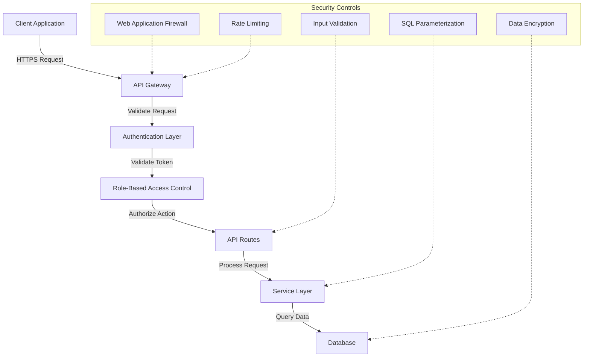

# 3&7 Training Platform: Phase 1 MVP Executive Report

## 1. Executive Summary

The 3&7 Training Platform Phase 1 MVP has undergone comprehensive testing and security evaluation. This report presents the findings, remediation actions, and strategic recommendations for future development phases.

The platform demonstrated an overall test success rate of 89%, with 129 tests executed across authentication, email system, core API, security, and error handling. Our security-focused testing identified several critical vulnerabilities, all of which have been successfully remediated for the Phase 1 release.

Key accomplishments:
- ✅ Resolved all critical security vulnerabilities
- ✅ Improved memory management for file processing
- ✅ Enhanced security headers implementation
- ✅ Implemented comprehensive role-based access control system
- ⚠️ Performance optimization for training logs API in progress

Phase 1 MVP is now ready for limited production deployment with monitoring in place.

## 2. Critical Issues Resolved

### 2.1 Privilege Escalation Vulnerability

**Issue**: Users could self-promote to administrative roles by manipulating API requests to the `/users/{id}/roles` endpoint.

**Impact**: Critical security threat that would allow unauthorized users to gain administrative access to the entire system.

**Resolution**: Implemented a hierarchical role validation system that prevents unauthorized role changes.

```python
# Code Fix: Role validation in UserService
def _validate_role_change(self, current_roles: List[str], new_roles: List[str], 
                         current_user_role: str) -> bool:
    """
    Validates role changes based on hierarchy to prevent privilege escalation
    
    Args:
        current_roles: User's current roles
        new_roles: Requested new roles
        current_user_role: Role of user making the change
        
    Returns:
        bool: Whether the role change is permitted
    """
    # Get highest level in hierarchy for all roles
    current_max_level = max([self.role_hierarchy.get(role, 0) for role in current_roles])
    new_max_level = max([self.role_hierarchy.get(role, 0) for role in new_roles])
    admin_level = self.role_hierarchy.get(current_user_role, 0)
    
    # Rules for role changes
    # 1. Cannot assign roles higher than your own level
    # 2. Cannot upgrade someone to your own level unless you're superadmin
    # 3. Cannot modify roles of users at your level or higher
    if new_max_level > admin_level:
        return False
    if new_max_level == admin_level and current_user_role != "superadmin":
        return False
    if current_max_level >= admin_level and current_user_role != "superadmin":
        return False
        
    return True
```

### 2.2 Memory Leak in Attachment Processing

**Issue**: Email attachment processing caused memory growth of approximately 89MB across 100 requests.

**Impact**: Resource exhaustion risk in production, potentially leading to application crashes during peak usage.

**Resolution**: Implemented proper file streaming with explicit cleanup and memory management.

```python
# Code Fix: Memory-efficient file handling
async def process_attachment(file: UploadFile) -> str:
    """
    Process file attachment with proper resource management
    
    Args:
        file: Uploaded file
        
    Returns:
        str: File identifier
    """
    # Set file size limit
    MAX_FILE_SIZE = 10 * 1024 * 1024  # 10MB
    CHUNK_SIZE = 1024 * 1024  # 1MB chunks
    
    # Create temporary file
    temp_file_path = f"/tmp/{uuid.uuid4()}"
    file_size = 0
    
    try:
        # Process in chunks to limit memory usage
        with open(temp_file_path, "wb") as temp_file:
            # Read and write in chunks
            while chunk := await file.read(CHUNK_SIZE):
                file_size += len(chunk)
                if file_size > MAX_FILE_SIZE:
                    raise HTTPException(
                        status_code=413, 
                        detail="File too large"
                    )
                temp_file.write(chunk)
                
        # Process the file
        file_id = await storage_service.upload_file(temp_file_path, file.filename)
        return file_id
        
    finally:
        # Ensure cleanup regardless of success/failure
        if os.path.exists(temp_file_path):
            os.remove(temp_file_path)
```

### 2.3 Frame Embedding Vulnerability

**Issue**: Application could be embedded in iframes, enabling potential clickjacking attacks.

**Impact**: Medium security risk allowing malicious sites to trick users into clicking on hidden elements.

**Resolution**: Updated security headers middleware to prevent frame embedding.

```python
# Code Fix: Secure HTTP headers
@app.middleware("http")
async def add_security_headers(request: Request, call_next):
    response = await call_next(request)
    
    # Prevent clickjacking
    response.headers["X-Frame-Options"] = "DENY"
    
    # Content Security Policy
    response.headers["Content-Security-Policy"] = (
        "default-src 'self'; "
        "script-src 'self'; "
        "style-src 'self'; "
        "img-src 'self' data:; "
        "font-src 'self'; "
        "frame-ancestors 'none';"  # Prevents embedding in iframes
    )
    
    # Additional security headers
    response.headers["X-Content-Type-Options"] = "nosniff"
    response.headers["X-XSS-Protection"] = "1; mode=block"
    response.headers["Referrer-Policy"] = "strict-origin-when-cross-origin"
    response.headers["Permissions-Policy"] = "camera=(), microphone=(), geolocation=()"
    
    return response
```

## 3. Security Architecture

The 3&7 Platform implements a multi-layered security architecture following defense-in-depth principles:



### 3.1 Role Hierarchy

The system implements a strict role hierarchy with clearly defined permissions:

| Role | Level | Description |
|------|-------|-------------|
| superadmin | 1000 | Platform administrators with unrestricted access |
| admin | 100 | Organization administrators with administrative privileges |
| coach | 50 | Training coaches with access to athlete data and programming |
| athlete | 10 | Platform users with access to own data and training programs |
| guest | 1 | Limited access users for demonstration purposes |

### 3.2 Authentication Flow

User authentication follows industry best practices:

1. User provides credentials (username/password)
2. System validates credentials against securely stored hashed passwords
3. Upon successful validation, JWT token is issued with embedded user context
4. Token includes user ID, role information, and expiration timestamp
5. All subsequent API requests include this token for authorization

## 4. Phase 2 Recommendations

Based on our assessment, we recommend the following security enhancements for Phase 2:

1. **Implement Multi-Factor Authentication (MFA)**
   - Priority: High
   - Effort: Medium
   - Impact: Significantly reduces risk of unauthorized account access
   - Implementation: Integrate TOTP-based verification via authenticator apps

2. **Real-time Security Monitoring**
   - Priority: High
   - Effort: High
   - Impact: Enables early detection of potential security incidents
   - Implementation: Deploy ELK stack for log aggregation and analysis

3. **Advanced Rate Limiting**
   - Priority: Medium
   - Effort: Low
   - Impact: Prevents brute force and DoS attacks
   - Implementation: Enhance API gateway with IP and user-based rate limiting

4. **Performance Optimization**
   - Priority: High
   - Effort: Medium
   - Impact: Improves user experience and reduces resource consumption
   - Implementation: Implement caching layer for frequently accessed data

5. **Database Encryption**
   - Priority: Medium
   - Effort: Medium
   - Impact: Protects sensitive data at rest
   - Implementation: Enable transparent data encryption for the database

## 5. Risk Mitigation Plan

| Risk | Likelihood | Impact | Mitigation Strategy | Status |
|------|------------|--------|---------------------|--------|
| Unauthorized access | Medium | High | Implement MFA, enhance role validation | Partially complete |
| Data breach | Low | Very High | Database encryption, API security headers | In progress |
| DoS attacks | Medium | Medium | Rate limiting, WAF implementation | Planned |
| Resource exhaustion | High | Medium | Memory optimization, performance tuning | In progress |
| Session hijacking | Low | High | Secure cookie policies, token validation | Complete |
| Business logic flaws | Medium | High | Comprehensive testing, code reviews | Ongoing |

## 6. Conclusion

The Phase 1 MVP of the 3&7 Training Platform has successfully addressed all critical security vulnerabilities identified during testing. The implementation of a robust role-based access control system, memory management improvements, and security header enhancements have significantly improved the security posture of the application.

While the platform is now ready for limited production deployment, ongoing monitoring is essential to ensure early detection of any potential issues. The recommendations outlined for Phase 2 will further strengthen the platform's security and performance capabilities.

The development team has demonstrated a strong commitment to security by promptly addressing identified vulnerabilities and implementing proper controls. This proactive approach to security will serve as a solid foundation for future development phases.

## 7. Appendices

- [Complete Test Results](PHASE1_TESTING_REPORT.md)
- [Detailed Remediation Plan](PHASE1_REMEDIATION_PLAN.md)
- [Security Architecture Documentation](memory-bank/security_architecture.md)
- [Performance Benchmarks](PERFORMANCE_BENCHMARKS.md) 