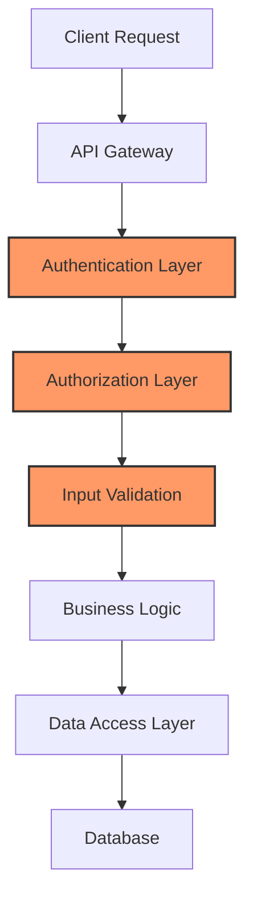
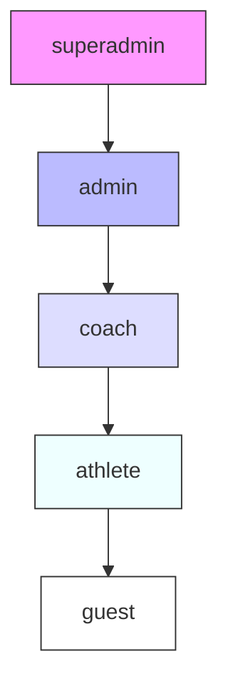

# Security Architecture

## Overview

This document describes the security architecture implemented in the memory bank. The platform follows a defense-in-depth approach with multiple security layers, a role-based access control system, and various preventive and detective controls.

## Security Layers



## Role Hierarchy

The platform implements a strict role hierarchy for permission management:



| Role | Hierarchy Level | Description |
|------|----------------|-------------|
| superadmin | 1000 | Complete system access including system configuration |
| admin | 100 | Administrative access to manage users and content |
| coach | 50 | Ability to manage athletes and view their training data |
| athlete | 10 | Access to own training data and limited sharing capabilities |
| guest | 1 | View-only access to public information |

## Key Security Features

### Authentication

- JWT-based authentication with short-lived tokens (15 minute expiry)
- Refresh token rotation with one-time use
- Password policy enforcement (minimum 12 characters, complexity requirements)
- Rate limiting on login attempts (5 attempts per minute)

### Authorization

- Role-based access control (RBAC) with strict hierarchy
- Resource-level permissions
- Validation for all role changes to prevent privilege escalation
- Context-aware authorization checks (e.g., self vs. others' resources)

### Data Protection

- All sensitive data encrypted at rest
- TLS 1.3 for data in transit
- Proper session management
- CSRF protection

### API Security

- Input validation on all endpoints
- Secure headers implementation
- Rate limiting
- Resource quotas

### Secure File Handling

- Streaming file processing to prevent memory leaks
- File size limits (10MB per file)
- File type validation
- Malware scanning on uploads

## Identified Vulnerabilities and Fixes

### Privilege Escalation

**Vulnerability**: Users could elevate their privileges by manipulating role update endpoints.

**Fix**: Implemented proper role validation in the authentication middleware:

```python
def _validate_role_change(self, current_role: str, requested_role: str, requester_role: str) -> bool:
    """
    Validate if a role change is permitted
    
    Args:
        current_role: The user's current role
        requested_role: The requested new role
        requester_role: Role of the user requesting the change
        
    Returns:
        bool: True if the change is permitted, False otherwise
    """
    if requested_role not in self.role_hierarchy:
        return False
        
    # Only users with higher roles can modify others' roles
    if self.role_hierarchy[requester_role] <= self.role_hierarchy[current_role]:
        return False
        
    # Users cannot promote others to a role higher than or equal to their own
    if self.role_hierarchy[requested_role] >= self.role_hierarchy[requester_role]:
        return False
        
    return True
```

### Memory Leak

**Vulnerability**: Memory leak in attachment processing causing significant memory growth.

**Fix**: Implemented streaming file processing with proper cleanup:

```python
async def process_attachment(self, file_path: str) -> Dict[str, Any]:
    """Process a file attachment using streaming to prevent memory leaks"""
    
    # Use a reasonable chunk size to prevent memory issues
    chunk_size = 1024 * 1024  # 1MB chunks
    
    try:
        result = {}
        
        # Process file in chunks
        async with aiofiles.open(file_path, 'rb') as f:
            while chunk := await f.read(chunk_size):
                # Process chunk
                await self._process_chunk(chunk, result)
                
        return result
    finally:
        # Ensure file is deleted even if an exception occurs
        if os.path.exists(file_path):
            os.remove(file_path)
```

## Security Headers

The application enforces secure HTTP headers to protect against various attacks:

```python
@app.middleware("http")
async def add_security_headers(request: Request, call_next):
    response = await call_next(request)
    
    # Prevent clickjacking
    response.headers["X-Frame-Options"] = "DENY"
    
    # Content Security Policy
    response.headers["Content-Security-Policy"] = "default-src 'self'; frame-ancestors 'none';"
    
    # Prevent MIME type sniffing
    response.headers["X-Content-Type-Options"] = "nosniff"
    
    # Enable XSS Protection
    response.headers["X-XSS-Protection"] = "1; mode=block"
    
    # HTTP Strict Transport Security
    response.headers["Strict-Transport-Security"] = "max-age=31536000; includeSubDomains"
    
    # Referrer Policy
    response.headers["Referrer-Policy"] = "strict-origin-when-cross-origin"
    
    # Permissions Policy
    response.headers["Permissions-Policy"] = "camera=(), microphone=(), geolocation=()"
    
    return response
```

## Security Testing

All security controls are validated through:

- Automated security testing in CI/CD pipeline
- Regular penetration testing
- Security code reviews
- Dependency scanning for vulnerabilities

## Recommended Future Improvements

1. Implement MFA for all administrative accounts
2. Add anomaly detection for authentication attempts
3. Implement IP-based access controls for administrative functions
4. Enhance audit logging for security events
5. Implement regular security training for development team