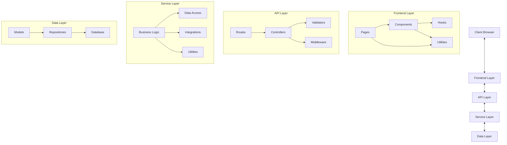
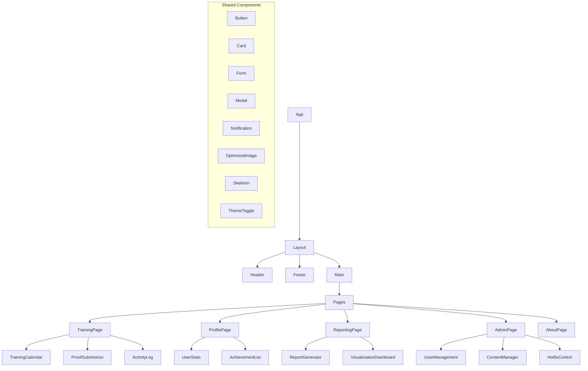
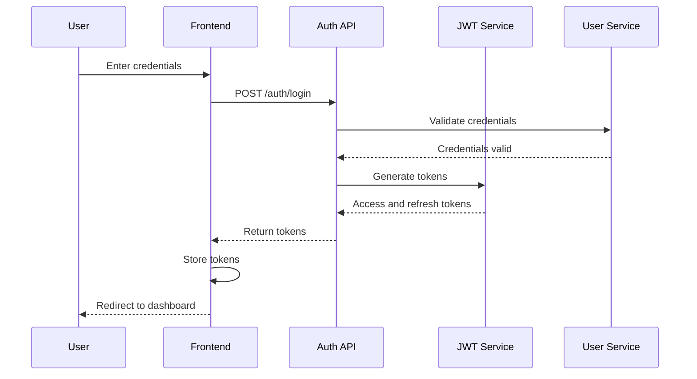
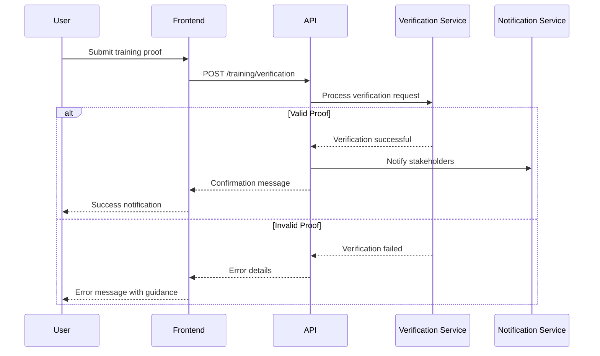
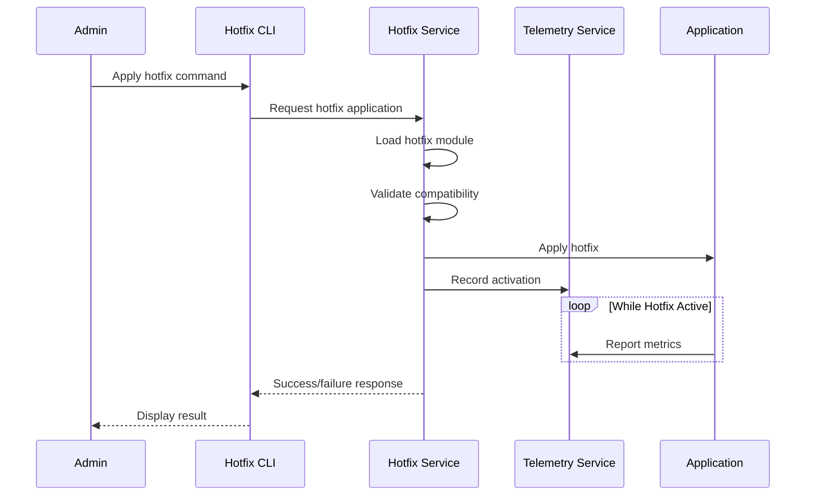
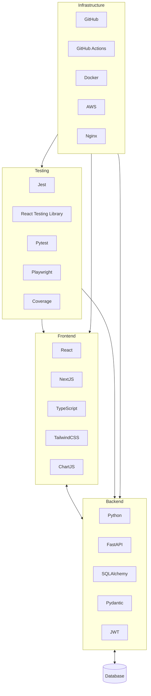

# 3&7 Training Platform - System Patterns

## Architecture Overview

The 3&7 Training Platform follows a modern, component-based architecture with clear separation of concerns:



## Key Technical Decisions

### Frontend Architecture
1. **Next.js with TypeScript**: Chosen for type safety, server-side rendering capabilities, and improved SEO
2. **React Context + Hooks**: Used for state management rather than Redux for simplicity
3. **TailwindCSS**: Selected for utility-first styling approach and design consistency
4. **Component-First Development**: All UI elements constructed from reusable components
5. **Progressive Enhancement**: Core functionality works without JavaScript, enhanced with client-side features
6. **Custom Theme Provider**: Implemented for dark/light mode support with localStorage persistence

### Backend Architecture
1. **FastAPI**: Chosen for performance, automatic OpenAPI documentation, and Python ecosystem compatibility
2. **Domain-Driven Design**: Organized around business domains to improve maintainability
3. **Repository Pattern**: Abstracts data access behind consistent interfaces
4. **Layered Architecture**: Clear separation between API, service, and data access layers
5. **Dependency Injection**: Used for service composition and testability
6. **Modular Hotfix Framework**: Enables runtime application of fixes without full deployments

### Testing Approach
1. **Pyramid Strategy**: More unit tests than integration tests, more integration than E2E tests
2. **Mock-Based Testing**: External dependencies mocked for reliable test execution
3. **Test Environment Isolation**: Each test runs in its own environment to prevent side effects
4. **Performance Benchmarking**: Automated tests verify response times against thresholds
5. **Security Testing**: Automated checks for common vulnerabilities and proper header implementation
6. **Visual Reporting**: Interactive HTML reports generated for test results analysis

## Design Patterns

### Frontend Patterns
1. **Component Composition**: Building complex UIs from smaller, focused components
2. **Custom Hooks**: Extracting reusable stateful logic (e.g., useAuth, useForm, useTheme)
3. **Render Props**: Sharing code between components using a prop whose value is a function
4. **Context Providers**: Managing global state like authentication, theme, and notifications
5. **Error Boundaries**: Catching JavaScript errors in components to prevent UI crashes
6. **Container/Presentation Pattern**: Separating data-fetching logic from rendering components

### Backend Patterns
1. **Factory Pattern**: Creating objects without specifying exact class
2. **Adapter Pattern**: Converting one interface to another (used for third-party integrations)
3. **Strategy Pattern**: Selecting algorithm at runtime (e.g., verification methods)
4. **Observer Pattern**: Notifying subscribers about events (e.g., training completion)
5. **Repository Pattern**: Abstracting data access logic
6. **Middleware Chain**: Processing requests through a series of handlers
7. **Circuit Breaker**: Preventing cascading failures in distributed communications

### Testing Patterns
1. **Arrange-Act-Assert**: Structuring tests for clarity
2. **Dependency Injection**: Making tests more controllable and isolated
3. **Fixtures**: Reusing test setup code and test data
4. **Parameterized Testing**: Running same test with different inputs
5. **Snapshot Testing**: Verifying UI components render consistently
6. **Test Doubles**: Using stubs, mocks, and fakes to isolate system under test

## Component Relationships

### Frontend Component Hierarchy



### API Endpoint Structure

```mermaid
graph TD
    API[API Root] --> Auth[/auth]
    API --> Users[/users]
    API --> Training[/training]
    API --> Reports[/reports]
    API --> Admin[/admin]
    API --> System[/system]
    
    Auth --> Login[POST /login]
    Auth --> Logout[POST /logout]
    Auth --> Refresh[POST /refresh]
    
    Users --> UserCRUD[CRUD operations]
    Users --> UserProfile[/profile]
    Users --> UserPreferences[/preferences]
    
    Training --> Sessions[/sessions]
    Training --> Progress[/progress]
    Training --> Verification[/verification]
    Training --> Feedback[/feedback]
    
    Reports --> Generate[POST /generate]
    Reports --> Templates[/templates]
    Reports --> Export[/export]
    
    Admin --> ManageUsers[/users]
    Admin --> ManageContent[/content]
    Admin --> SystemSettings[/settings]
    
    System --> Health[/health]
    System --> Metrics[/metrics]
    System --> Hotfixes[/hotfixes]
```

## Data Flow Patterns

### Authentication Flow



### Training Verification Flow



### Hotfix Application Flow



## Technology Stack Integration

The system integrates various technologies to provide a complete solution:



This system architecture provides a solid foundation for building and extending the 3&7 Training Platform while ensuring maintainability, scalability, and reliability. 