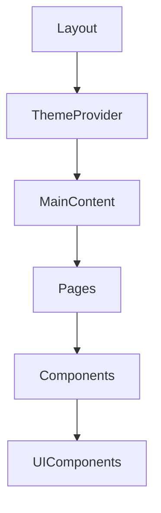

# 3&7 Training Platform - System Patterns

## Architecture Overview
The 3&7 platform follows a component-based architecture using React and Next.js, with a strong emphasis on reusable UI components and proper state management.

## Key Design Patterns
- **Component Composition**: Building complex interfaces from simple, reusable components
- **Provider Pattern**: Used for theme management, toast notifications, and other cross-cutting concerns
- **Progressive Enhancement**: Ensuring core functionality works even in constrained environments
- **Responsive Design**: Adapting interfaces appropriately across device sizes

## Component Hierarchy

## State Management
- Local component state for UI-specific states
- Context API for cross-cutting concerns (theme, notifications)
- Future implementation will include more robust state management for application data

## Data Flow Patterns
- Unidirectional data flow within components
- Explicit prop passing for component configuration
- Event-based communication for user interactions 