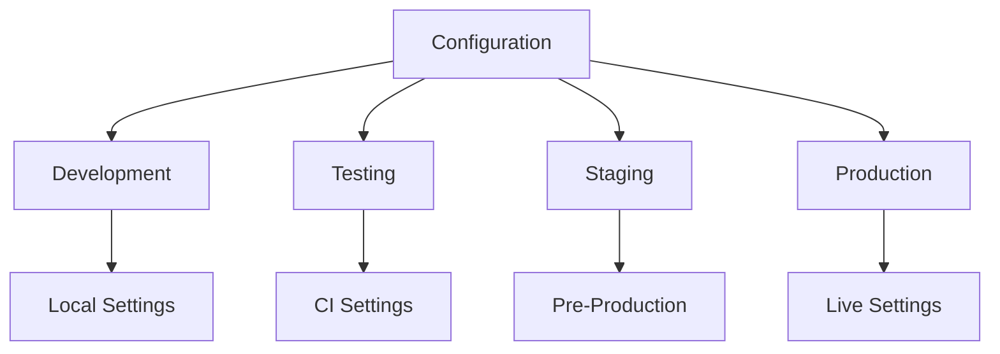
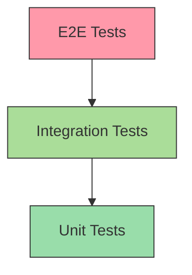
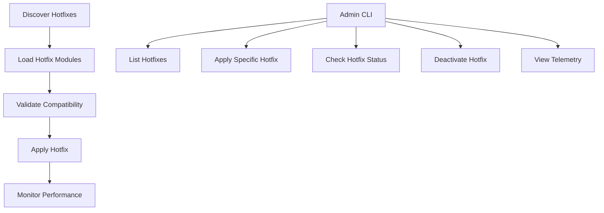

# 3&7 Training Platform - Technical Context

## Technology Stack

### Frontend Technologies
- **Framework**: Next.js 14+ with App Router
- **Language**: TypeScript 5.0+
- **UI Library**: React 18+
- **Styling**: TailwindCSS 3.3+
- **State Management**: React Context API, local state with useState/useReducer
- **Data Fetching**: SWR for client-side fetching, Next.js server components for server data
- **Animation**: Framer Motion for sophisticated animations, CSS transitions for simple ones
- **Forms**: React Hook Form for form state management and validation
- **Charts/Visualization**: Chart.js with React wrapper
- **Icons**: Heroicons, custom SVGs
- **Testing**: Jest, React Testing Library

### Backend Technologies
- **Language**: Python 3.10+
- **Framework**: FastAPI
- **API Documentation**: Swagger UI (auto-generated)
- **Authentication**: JWT-based authentication
- **Database**: PostgreSQL with SQLAlchemy ORM
- **Validation**: Pydantic
- **Testing**: Pytest, pytest-asyncio
- **Performance Testing**: Locust
- **Security Testing**: Bandit, OWASP ZAP

### Infrastructure
- **Version Control**: Git, GitHub
- **CI/CD**: GitHub Actions
- **Containerization**: Docker
- **Hosting**: AWS (ECS, S3, CloudFront)
- **Monitoring**: Datadog
- **Logging**: ELK Stack (Elasticsearch, Logstash, Kibana)

## Development Environment

### Prerequisites
- Node.js 18.0+
- Python 3.10+
- Docker Desktop
- Git
- Visual Studio Code (recommended)

### Setup Instructions
1. Clone repository from GitHub
2. Install frontend dependencies: `npm install`
3. Install backend dependencies: `pip install -r requirements.txt`
4. Set up environment variables:
   - Create `.env.local` for frontend environment variables
   - Create `.env` for backend environment variables
5. Start development server:
   - Frontend: `npm run dev`
   - Backend: `python -m uvicorn api.main:app --reload`
6. Access development environment:
   - Frontend: http://localhost:3000
   - Backend API: http://localhost:8000
   - API Documentation: http://localhost:8000/docs

### VS Code Extensions
- ESLint
- Prettier
- Tailwind CSS IntelliSense
- Python
- Pylance
- Docker
- GitLens
- Error Lens

### Common Commands
```bash
# Frontend
npm run dev           # Start development server
npm run build         # Create production build
npm run start         # Start production server
npm run lint          # Run ESLint
npm run test          # Run Jest tests
npm run storybook     # Start Storybook UI component explorer

# Backend
python -m pytest                  # Run all tests
python -m pytest -xvs tests/api/  # Run API tests with verbose output
python hotfixes/apply_hotfixes.py --list  # List available hotfixes
python -m uvicorn api.main:app --reload   # Start API server
```

## Technical Constraints

### Performance Requirements
- Initial page load < 2 seconds
- Time to interactive < 3 seconds
- API response time < 300ms (95th percentile)
- Lighthouse performance score > 90
- Server response time < 100ms (95th percentile)
- Mobile optimization strategies for low-bandwidth conditions

### Security Requirements
- HTTPS-only deployment
- JWT with proper expiration and refresh strategy
- OWASP Top 10 protection
- Input validation on all form fields
- Content Security Policy implementation
- Regular security audits
- Secure HTTP headers on all responses
- Rate limiting to prevent abuse

### Accessibility Requirements
- WCAG 2.1 AA compliance
- Keyboard navigation support
- Screen reader compatibility
- Proper focus management
- Sufficient color contrast
- Descriptive aria attributes
- Responsive to user preferences (reduced motion, etc.)

### Browser Support
- Chrome (latest 2 versions)
- Firefox (latest 2 versions)
- Safari (latest 2 versions)
- Edge (latest 2 versions)
- Mobile Safari iOS 12+
- Chrome for Android (latest version)

## Dependencies and External Integrations

### Frontend Dependencies
Key dependencies include:
- next: ^14.0.0
- react: ^18.2.0
- react-dom: ^18.2.0
- typescript: ^5.0.4
- tailwindcss: ^3.3.0
- swr: ^2.1.5
- framer-motion: ^10.12.0
- react-hook-form: ^7.43.9
- chart.js: ^4.2.1
- react-chartjs-2: ^5.2.0
- @heroicons/react: ^2.0.17
- classnames: ^2.3.2
- date-fns: ^2.30.0

### Backend Dependencies
Key dependencies include:
- fastapi: ^0.95.0
- uvicorn: ^0.21.1
- pydantic: ^1.10.7
- sqlalchemy: ^2.0.9
- alembic: ^1.10.3
- pytest: ^7.3.1
- python-jose: ^3.3.0
- passlib: ^1.7.4
- python-multipart: ^0.0.6
- httpx: ^0.24.0
- bandit: ^1.7.5
- pytest-cov: ^4.1.0
- jinja2: ^3.1.2

### External Services
- AWS S3 for file storage
- SendGrid for email notifications
- Stripe for payment processing (future)
- Google Maps API for location verification
- AWS CloudFront for content delivery
- GitHub for version control and CI/CD

## Configuration Management

### Environment Configuration
The platform uses different configuration settings based on the environment:



Configuration is loaded from:
1. Environment variables
2. Environment-specific `.env` files
3. Default configuration

### Feature Flags
Feature flags are used to enable/disable features across environments:
- Controlled through environment variables
- UI exposed for admin users to toggle specific flags
- Used for A/B testing and phased feature rollouts
- Integrated with the hotfix system for runtime control

## Testing Strategy

### Testing Pyramid



- **Unit Tests**: Test individual functions and components in isolation
- **Integration Tests**: Test interactions between components
- **E2E Tests**: Test complete user flows

### Specialized Test Types
- **Security Tests**: Verify proper implementation of security headers, authentication, and authorization
- **Performance Tests**: Measure and validate API response times against thresholds
- **Accessibility Tests**: Ensure WCAG compliance and proper screen reader support
- **Contract Tests**: Verify API responses match OpenAPI specification
- **Visual Tests**: Compare screenshots to detect unexpected UI changes
- **Flaky Tests**: Identify tests with inconsistent results

### Testing Infrastructure
The platform includes comprehensive testing tools:
- Mock API with authentication, security headers, and rate limiting
- Test runners with detailed logging and reporting
- CI/CD integration via GitHub Actions
- Visual reporting with executive summaries and action items
- Debug utilities for capturing system state during test execution

## Deployment Pipeline

```mermaid
graph LR
    Code[Code Changes] --> Build[Build]
    Build --> UnitTest[Unit Tests]
    UnitTest --> Lint[Linting]
    Lint --> Security[Security Scan]
    Security --> Deploy[Deploy to Staging]
    Deploy --> IntTest[Integration Tests]
    IntTest --> PerfTest[Performance Tests]
    PerfTest --> Approval[Approval]
    Approval --> Production[Deploy to Production]
    Production --> Monitoring[Post-Deploy Monitoring]
```



The deployment process:
1. Code changes are committed to a feature branch
2. Pull request is created for review
3. GitHub Actions runs test suite and linting
4. Upon approval and merge, changes are deployed to staging
5. Integration and E2E tests run against staging
6. Manual QA and approval
7. Deploy to production
8. Post-deployment monitoring for errors or performance issues

## Hotfix System

The platform includes a modular hotfix framework that allows for runtime application of fixes without requiring a full deployment:



- **Discovery**: Hotfixes are discovered dynamically from the hotfixes directory
- **Loading**: Each hotfix is a Python module with a defined interface
- **Validation**: Hotfixes include schema version checks for compatibility
- **Application**: Hotfixes use monkey patching or other techniques to modify runtime behavior
- **Telemetry**: Performance impact and effectiveness are monitored
- **Management**: CLI tool provides administration capabilities

This technical architecture provides a solid foundation for developing, testing, and maintaining the 3&7 Training Platform while ensuring high quality and reliability.